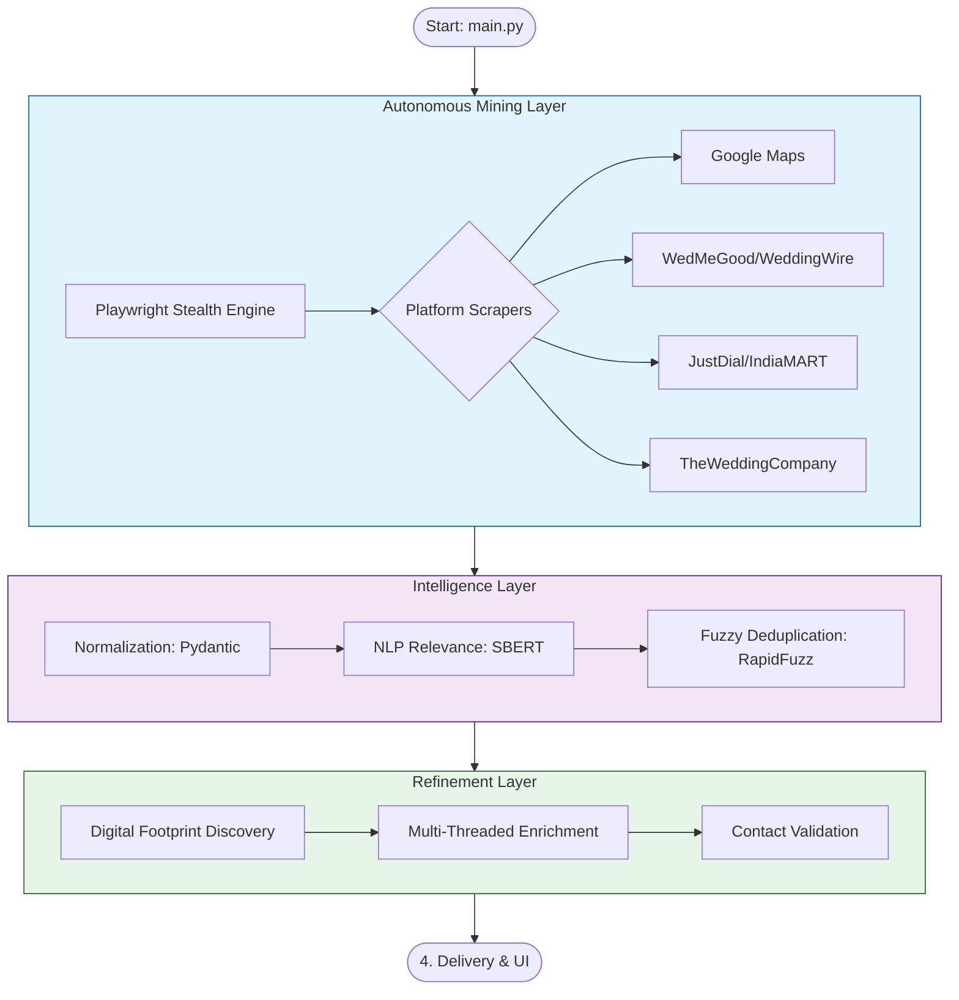

# IntelliLead: Advanced AI B2B Lead Intelligence
## Technical Architecture & Workflow Documentation

**IntelliLead** is an autonomous B2B data engineering ecosystem. It replaces manual lead research with an **Agentic Pipeline** that performs high-speed web automation, semantic AI validation, and multi-source data fusion to build a verified, high-converting lead database.

---

### 1. Unified Workflow Architecture
The system follows a sequential, checkpointed pipeline. Each stage is designed to increase the "entropy" (value) of the data while reducing "noise" (junk).

---

### 2. Deep Technical Breakdown

#### **A. Autonomous Browser Automation (`scrapers/`)**
To gather data without getting blocked or triggering CAPTCHAs, the system uses a **stealth-first** browser architecture:
*   **Engine**: `playwright-python` with `playwright-stealth`.
*   **Bot Evasion Strategy**:
    *   **HTTP/1.1 Downgrade**: Force HTTP/1.1 protocol to bypass advanced HTTP/2 fingerprinting used by sites like JustDial.
    *   **Context Spoofing**: Overwrites `navigator.webdriver` and injects fake plugins/languages via `context.add_init_script`.
    *   **Locale & Timezone Injection**: Matches browser settings to 'Asia/Kolkata' to appear as a local Indian user.
    *   **Human-Like Interaction**: Implements `human_scroll` and randomized delays between actions.

#### **B. Semantic AI Verification (`models/relevance_classifier.py`)**
Traditional scrapers often return junk (e.g., a "Hotel" in a search for "Event Planner"). IntelliLead uses a two-stage filter:
1.  **Negative Heuristics**: Keyword-based rejection (e.g., removing "Sweet Shop", "Clinic").
2.  **Semantic Similarity**: Uses the **Sentence-Transformer** model (`all-MiniLM-L6-v2`) to calculate the cosine similarity between the business description and the target industry. If the similarity score is below 0.60, the lead is discarded.

#### **C. Multi-Source Fuzzy Deduplication (`models/duplicate_matcher.py`)**
When the same company is found on multiple platforms, the system identifies and merges them using **RapidFuzz** similarity scoring:
*   **Weighted Scoring Algorithm**:
    *   **Business Name (50%)**: Token Sort Ratio.
    *   **Contact Phone (25%)**: Exact match on last 10 digits.
    *   **Website URL (15%)**: Normalized string match.
    *   **Full Address (10%)**: Token Set Ratio.
*   **Merge Logic**: If a match is found, the system combines data—taking the highest rating from Source A and the contact number from Source B.

#### **D. Digital Footprint Discovery (`pipelines/enrich.py`)**
For leads with missing data, the system launches a background "Discovery Agent":
*   **Search Engine Scraping**: Uses DuckDuckGo to discover missing Facebook/Instagram/LinkedIn links.
*   **Direct Web Crawling**: Uses `BeautifulSoup` to visit official business websites and scrape hidden contact numbers and social metadata.
*   **Concurrency**: Uses `ThreadPoolExecutor` to handle I/O-bound enrichment for 10 records simultaneously.

---

### 3. Database & Resilience Layer (`models/database.py`)
*   **Storage**: High-performance SQLite database (`data/leads.sqlite`).
*   **Transactional Checkpointing**: progress is saved at every city/platform milestone in `checkpoints.sqlite`.
*   **Failure Recovery**: If the system loses internet or power, it detects the last successful city and **automatically resumes** without duplicating data.

---

### 4. Presentation & Business Impact
*   **Modern UI (`app.py`)**: A Streamlit application providing real-time data visualization, confidence scoring distribution, and regional analytics.
*   **Master Export (`pipelines/export_excel.py`)**: Generates a professional Excel file with separate city-wise tabs, formatted for immediate use by Sales and Marketing teams.

---

### 5. Technical Stack Summary
*   **Language**: Python 3.10+
*   **Automation**: Playwright, BeautifulSoup4.
*   **AI/NLP**: Sentence-Transformers, PyTorch.
*   **Algorithms**: RapidFuzz (Fuzzy Logic), Regex (Validation).
*   **Frontend**: Streamlit.
*   **Storage**: SQLite3.
